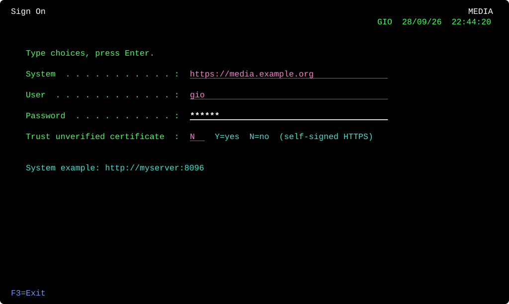
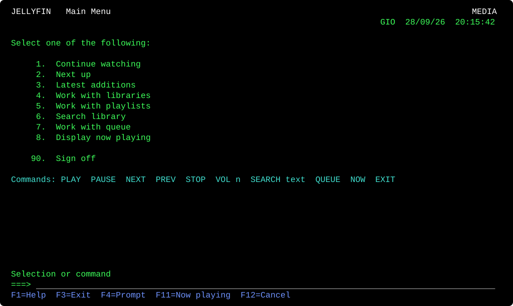
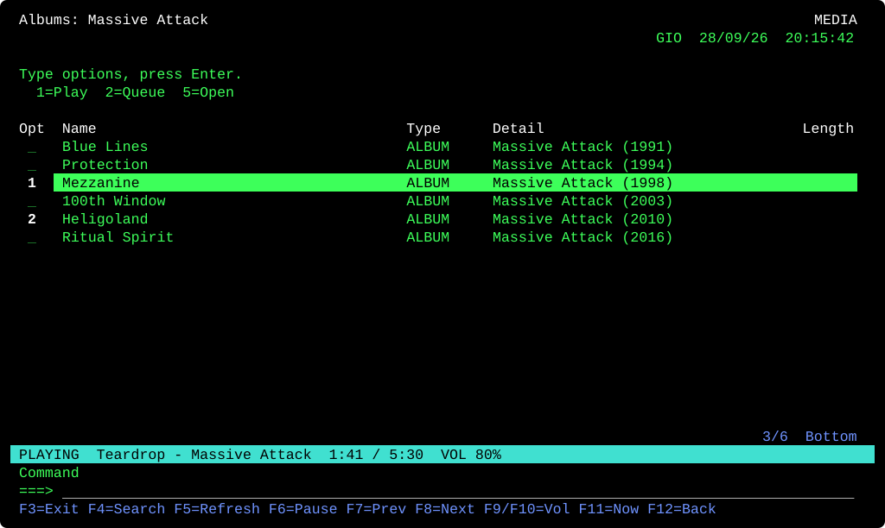
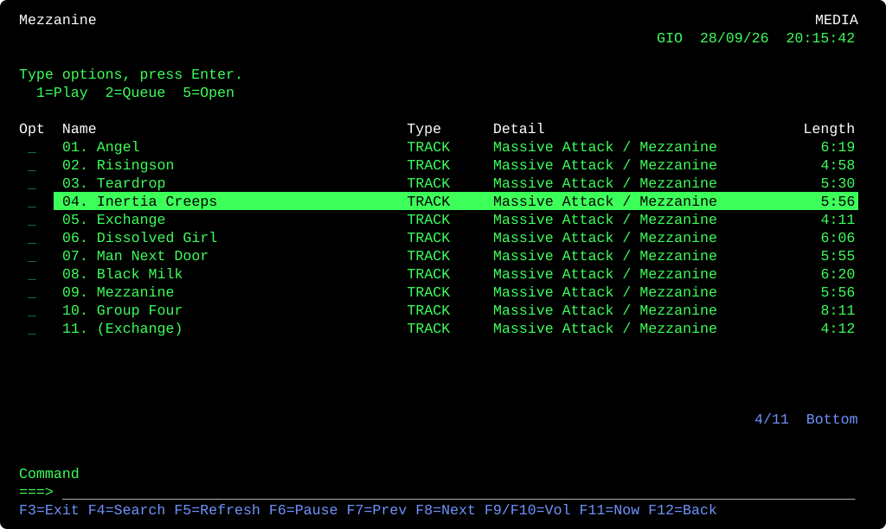
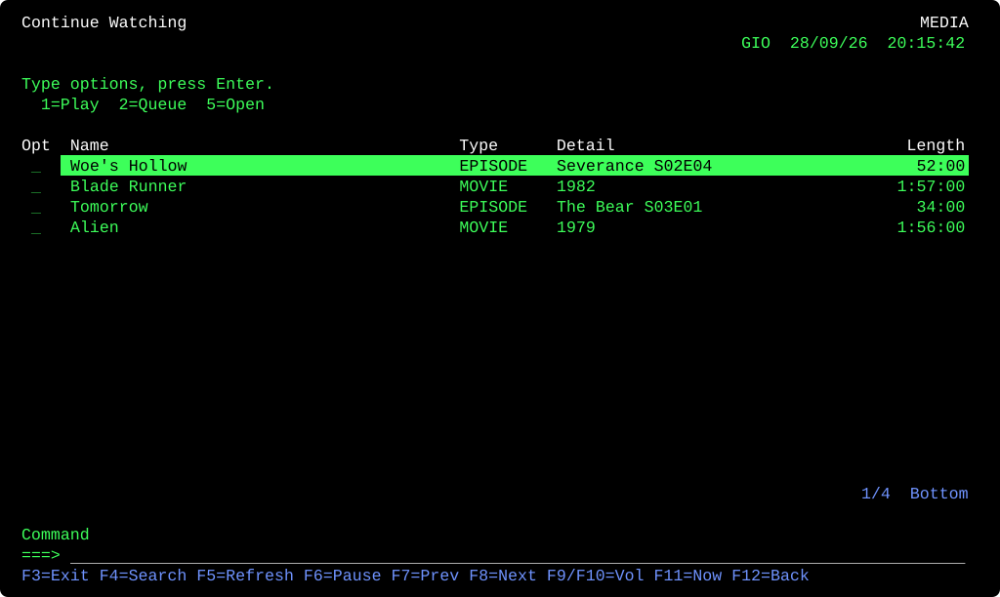
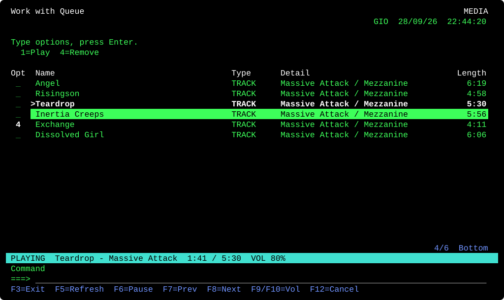
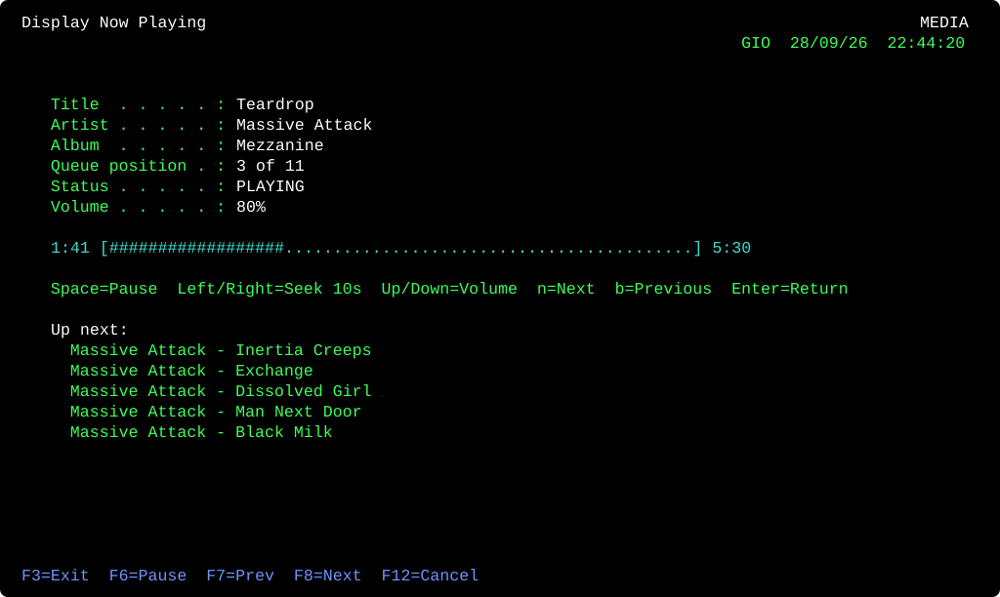

# jf400

A Jellyfin terminal client with an IBM AS/400 (5250) look and feel. Music and video, played through mpv.

Green on black, numbered menus, subfile-style lists with an `Opt` column, a `===>` command line, and an F-key bar.

## Screenshots

Mock data, rendered from the real UI code.

| | |
|---|---|
|  |  |
|  |  |
|  |  |



## Requirements

- Rust (2024 edition)
- `mpv` on your `PATH`
- A Jellyfin server
- Linux (mpv is controlled over a Unix socket; media keys use D-Bus/MPRIS)

## Run

```sh
cargo run --release
```

Sign on with your server URL, user, and password. The access token is saved in `~/.config/jf400/config.json`. Your password is not stored.

If your server uses a self-signed HTTPS certificate, set "Trust unverified certificate" to `Y` on the sign-on screen.

## Using it

**Menu:** type a number or a command and press Enter.

**Lists:** move with Up/Down/PgUp/PgDn/Home/End. Type an option in the `Opt` column, then press Enter.

| Option | Action |
|---|---|
| `1` | Play (tracks play on through the list; folders play everything inside) |
| `2` | Add to queue |
| `5` | Open |
| `4` | Remove (queue screen only) |

Enter on its own opens the highlighted row, or plays it if it is a track or video. Episodes in a season list play on through the season.

Long lists load in pages of 200 as you scroll.

**Function keys**

| Key | Action |
|---|---|
| F1 | Help |
| F3 | Exit |
| F4 | Search |
| F5 | Refresh |
| F6 / F7 / F8 | Pause / Previous / Next |
| F9 / F10 | Volume down / up |
| F11 | Now playing |
| F12 or Esc | Back (Esc first clears typed input) |

**Commands:** `SEARCH text`, `QUEUE`, `NOW`, `CONTINUE`, `NEXTUP`, `LATEST`, `PAUSE`, `NEXT`, `PREV`, `STOP`, `VOL n`, `MENU`, `SIGNOFF`, `EXIT`.

## Features

- Continue watching, next up, latest additions, libraries, playlists, search
- Music browsing by artist, album, or song
- Play queue with add and remove
- Video plays in a fullscreen mpv window
- Progress sync: reports start, progress, and stop to Jellyfin, and resumes video from the saved position
- Media keys and desktop widgets through MPRIS (built in, no mpv plugin needed)

## Known gaps

- No shuffle or repeat
- No favorites or mark-as-played
- No transcoding (direct play only)
- No album art
- The API token is in the stream URL, so it is visible in the process list
- Non-Latin names may misalign columns

## License

MIT. See [LICENSE](LICENSE).
